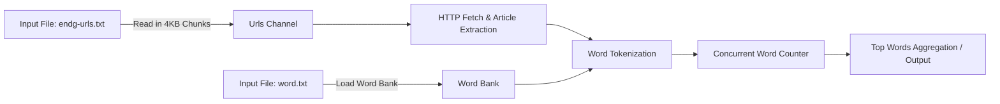

# Firefly Home Assignment

## Description
This home assignment's solution was designed as a Golang-based concurrent processing tool for extracting text from thousands of URLs and counting occurrences of predefined words.

It is designed to handle large input files (e.g. 40,000+ URLs) efficiently by combining:

- Chunked file reading → Reads large input files (URLs list) in 4KB chunks, streaming them into worker goroutines through channels

- Concurrent workers → Each URL is fetched in parallel with proper synchronization

- Global rate limiting → Requests are throttled (~5 requests per second) using a token bucket to avoid overwhelming servers

- Article text extraction → The response body is parsed and tokenized into words

- Dictionary-based word counting → Only words from a configured words.txt dictionary (the “Words Bank”) are tracked

- Safe concurrency → Uses optimized counting logic with reduced locking for high throughput

## Features
- 🚀 Process tens of thousands of URLs concurrently without memory blowup.

- ⏱️ Global throttling – ensures responsible request rates.

- 📑 Regex-based word tokenization – ignores short words, focuses on meaningful tokens.

- 📊 Concurrent-safe word counter – aggregated results with minimal locking overhead.

- 🐳 Docker-ready – comes with a multi-stage Dockerfile for both dev (air hot reload) and production builds.
  
## Project Structure
- **/cmd/main.go**                # Entry point
- **/internal/readers/**          # File reader that streams URLs via channels
- **/internal/extractors/**       # Extract both words bank and essays files content into processed data
- **/internal/transports/**       # Responsible for communication. Can be extended to more protocols, rather than http 
- **/internal/sorts/**            # Sorting the extracted words count of all essays
- **/internal/outputs/**          # Responsible for the final output. Can be extended to more outputs formats, rather than pretty json
- **/internal/counters/**         # Concurrent word counter
- **/configs/**                   # Environment configs

### Artifacts:

- endg-urls – input file containing list of URLs (one per line)

- words.txt – dictionary of valid words to track

- .env – configuration file (e.g. paths, settings)

## Project Execution
There are 3 ways to run this projects:
1. Docker dev fashion:
   This option will run the project via air (Utility that detects code changes inside the container and restart the container)
   to run this option you should  enter the root project directory and run the following command:
   
   `docker-compose -f docker-compose.dev.yaml up`
   
   Final output and further logging will appear immediately on the screen 
   
3. Docker production fashion:
   This option will let you run the project in a mild manner (Using debian slim and the container including only the output file and also the config (.env) and input texts files).
   In order to run this option you should enter the root project directory and run the following command:
   
   `docker-compose up`
   
    Final output and further logging will appear immediately on the screen
   
5. Run the project locally
   For this option i can't guarantee the working directory will be retrieved correctly (Though using ```os.GetWd()```)
   In order to execute the project run the following commands:
   
```
mv .env.example .env
go run cmd/main.go
```

## Architecture Overview



### Description
I'll elaborate more about the solution structure and how decisions were made:
1. First step is to read the bank words file (Otherwise we can't move on and compare all the essays words). This action happens concurrently while checking the file into blocks of 4KB (It can be defined greater or lower.  I went for the
   the chunking standard as contribution of file in page table)
2. After receiving the bank words, we are starting to iterate on the urls files (Also in 4KB chunks). Each chunk that is being read (Approx. 50-70 urls) is being shifted to the extraction section. The other chunks can't continue until       the whole current chunk has finished its work .This decision may be losing some of the program performance, but it pledges us that the program won't take large amount of memory and that we'll not encounter any issues with goroutine waiting through the blocking checkpoint the extraction section is concealing (limiter, Wait Groups, etc.)
3. After getting each batch of urls we will arouse the same amount of goroutines as the amount of urls and then apply to them. there is a limit rate of 5 requests per second (Looks to me reasonable, but can be altered in the config file to     any other value)
4. Unsuccessful requests (Only encounter with ** 404 page not found requests **) are being logged and the execution linger on. The next step is to extract the words from the article. This is being done with ** golang.org/x/net/html **      package, whereas the tokens that are being considered are only the <article> tags and their content. In This manner, we are eliminating the irrelevant code and obtaining only the article content
5.  After we have each essay words (Only 3 or more words length) we can move on and update the global word counter map, as long the words are reside in  the word bank form step 1
6.  When we finally finish extracting all the essays and filling the word count map, we can now go and sort the map, by transforming it into an array of struct (The key is the word and valus is the word frequency).
    After we extract this array we can easily sort it (Equal appearances, are being drawn by the precedence of the compared word in the english alphabetic) and return it's top N members (10 in our case, left it mutable as well)
7. The final step is just to print the final sorted array from the previous step

## Keys For Improvements
- Adding unsuccessful requests retry mechanism (But not when retrieving 404 status)
- Implement checkpointing so long runs can resume after failure
- Aggregate results in batches per worker before merging
- Add unit tests 
     
